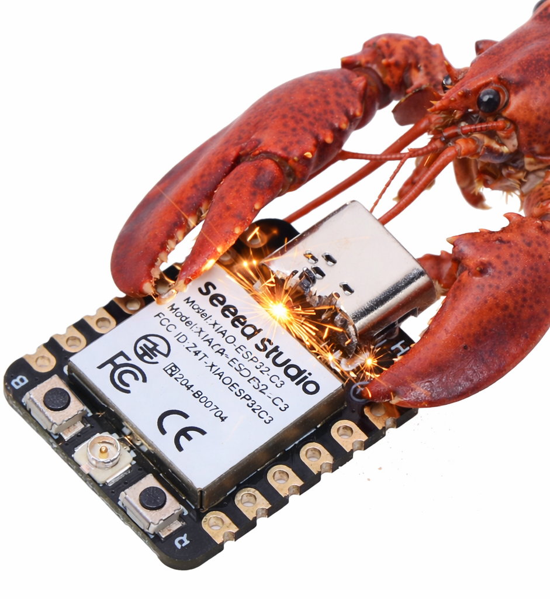

# ArduinoZClaw

[](https://opensource.org/licenses/MIT)
[](https://www.espressif.com/en/products/socs/esp32)
[](https://www.arduino.cc/)
---
> README Version 0.0.5 • Revised: April 19, 2026 • Ported By: rjjbatarao • [https://www.todo.com](https://www.todo.com)
The smallest possible AI personal assistant for ESP32.



The smallest possible AI personal assistant for ESP32.

zclaw is written in C and runs on ESP32 boards with a strict all-in firmware budget target of **<= 888 KiB** on the default build. It supports scheduled tasks, GPIO control, persistent memory, and custom tool composition through natural language.

The **888 KiB** cap is all-in firmware size, not just app code.
It includes `zclaw` logic plus ESP-IDF/FreeRTOS runtime, Wi-Fi/networking, TLS/crypto, and cert bundle overhead.

Fun to use, fun to hack on.
<br clear="right" />

---

## Overview

ArduinoZClaw is a, ESP-IDF port of zclaw for Arduino IDE, supports the following api backends:
- OpenAI
- Openrouter
- Anthroic Claude
- Ollama
- Others


## Features

- Chat via Telegram or hosted web relay
- Timezone-aware schedules (`daily`, `periodic`, and one-shot `once`)
- Built-in + user-defined tools
- For brand-new built-in capabilities, add a firmware tool (C handler + registry entry) via the Build Your Own Tool docs.
- Runtime diagnostics via `get_diagnostics` (quick/runtime/memory/rates/time/all scopes)
- GPIO, DHT, and I2C control with guardrails (including `gpio_read_all`, `i2c_scan`, `i2c_read`/`i2c_write`, and `dht_read`)
- USB local admin console for recovery, safe mode, and pre-network bring-up
- Persistent memory across reboots
- Persona options: `neutral`, `friendly`, `technical`, `witty`
- Provider support for Anthropic, OpenAI, OpenRouter, and Ollama (custom endpoint)

## Hardware

Tested targets: **ESP32**, **ESP32-C3**, **ESP32-S3**, and **ESP32-C6**.
Classic **ESP32-WROOM/ESP32 DevKit** boards are supported.
Test reports for other ESP32 variants are very welcome!

## Supported Platforms

| Platform          | Identifier           | Example Models                  | Tool Calls Support 
|-------------------|----------------------|---------------------------------|-------------------|
| OpenAI            | `"openai"`           | gpt-4.1, gpt-4o-mini, etc.           | Yes               | 
| OpenRouter     | `"openrouter"`           | openrouter/auto, openai/gpt-5.2, etc.                | Yes                | 
| Anthropic Claude | `"claude"`| claude-sonnet-4, claude-opus-4, etc.               | Yes               | 
| Ollama | `"ollama"`| qwen3:8b, etc.               | Yes               | 
| Others | `"others"`| others etc.               | Yes               |

## Dependency

**Note 1:** The **ArduinoZClaw** requires Latest Arduino ESP ESP-IDF v5.5.x


**Note 1:** Not tested on other Arduino ESP sdk versions, please let me know if it works on other sdk versions.

## Installation

### Manual Installation from GitHub

This method is for users who prefer to download the library directly from this repository.

1.  Click the "Code" button on this repository page and select "Download ZIP".
2.  In the Arduino IDE, go to `Sketch > Include Library > Add .ZIP Library...` and select the downloaded ZIP file.

## Start
Open the examples `Examples > Basic `

## Configuration
Edit zclaw_config.h as required by the configuration:

```cpp
#ifndef _ZCLAW_CONFIG__
#define _ZCLAW_CONFIG__

// -----------------------------------------------------------------------------
// Default configurations edit this
// -----------------------------------------------------------------------------
#define WIFI_SSID "mywifi"
#define WIFI_PASS "12345678"
#define LLM_BACKEND "anthropic"
#define LLM_API_KEY "sk-ant-api03-..."
#define LLM_MODEL "claude-opus-4-6"
#define LLM_API_URL "https://api.anthropic.com/v1/messages"
#define TG_TOKEN "123456:ABC..."
#define TG_CHAT_ID ""
#define TG_CHAT_IDS ""

#endif // end ZCLAW_CONFIG__
```
## Backend Options
```anthropic```
```openai```
```openrouter```
```ollama```
## Model Options
**Anthropic:**
```claude-sonnet-4-6```
```claude-haiku-4-5```
```claude-opus-4-6```
```Custom```
**OpenAI:**
```gpt-5.4```
```gpt-5-mini```
```gpt-4.1-mini```
```Custom```

**OpenRouter:**
```openrouter/auto```
```openai/gpt-5.2```
```openai/gpt-5-mini```
```anthropic/claude-sonnet-4.6```
```anthropic/claude-haiku-4.5```
```Custom```

**Ollama:**
```qwen3:8b```
```Custom```

**Others:**


## Url Options
**Anthropic:**
```https://api.anthropic.com/v1/messages```<br/>
**OpenAI:**
```https://api.openai.com/v1/models```<br/>
**OpenRouter:**
```https://openrouter.ai/api/v1/models```<br/>
**Ollama:**
```http://localhost:11434/v1/messages```<br/>

## Local Admin Console

When the board is in safe mode, unprovisioned, or the LLM path is unavailable, you can still operate it over USB serial without Wi-Fi or an LLM round trip. Use Serial Baudrate of `115200`.


Available local-only commands:

- `/gpio [all|pin|pin high|pin low]`
- `/diag [scope] [verbose]`
- `/reboot`
- `/wifi [status|scan]`
- `/bootcount`
- `/factory-reset confirm` (destructive; wipes NVS and reboots)

Full reference: [Local Admin Console](https://zclaw.dev/local-admin.html)

## Size Breakdown

Current default `esp32` breakdown (grouped image bytes from `idf.py -B build size-components`):

| Segment | Bytes | Size | Share |
| --- | ---: | ---: | ---: |
| zclaw app logic (`libmain.a`) | `39276` | ~38.4 KiB | ~4.6% |
| Wi-Fi + networking stack | `378624` | ~369.8 KiB | ~44.4% |
| TLS/crypto stack | `134923` | ~131.8 KiB | ~15.8% |
| cert bundle + app metadata | `98425` | ~96.1 KiB | ~11.5% |
| other ESP-IDF/runtime/drivers/libc | `201786` | ~197.1 KiB | ~23.7% |

Total image size from this build is `853034` bytes; padded `zclaw.bin` is `853184` bytes (~833.2 KiB), leaving `56128` bytes (~54.8 KiB) under the 888 KiB cap.


## License

MIT License - See [LICENSE](LICENSE) for details.

## Sources

- [Zclaw](https://github.com/tnm/zclaw)

---

💡 **Check out esp-idf version at [zclaw GitHub](https://github.com/tnm/zclaw)!**
